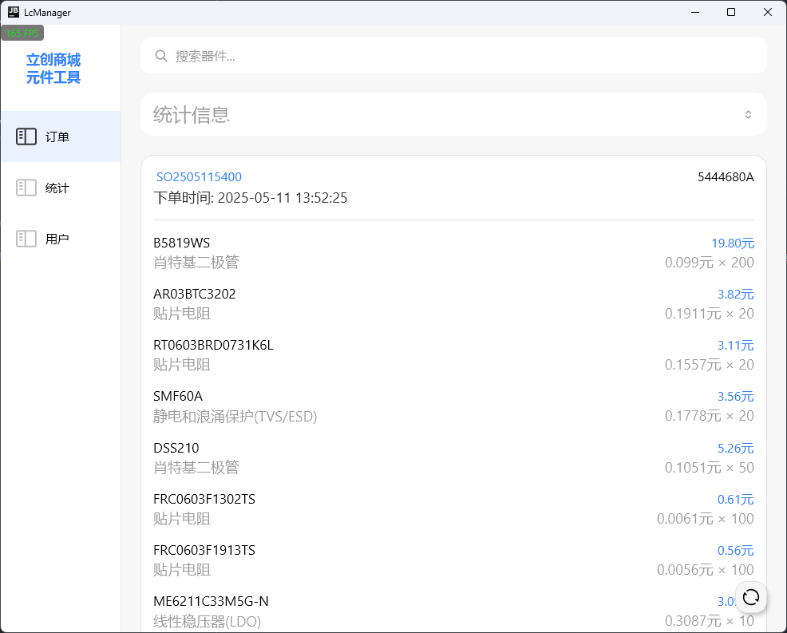
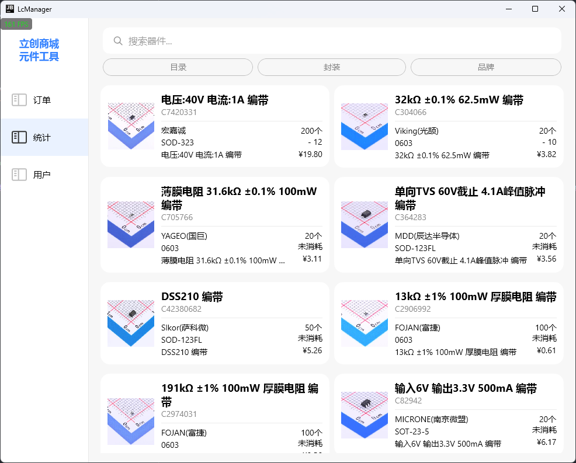
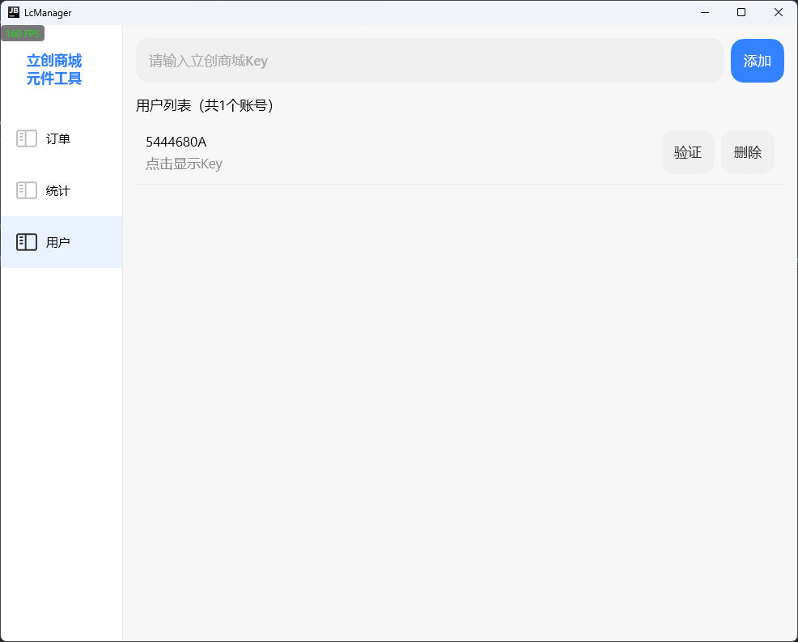
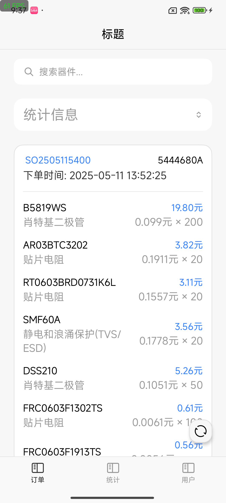
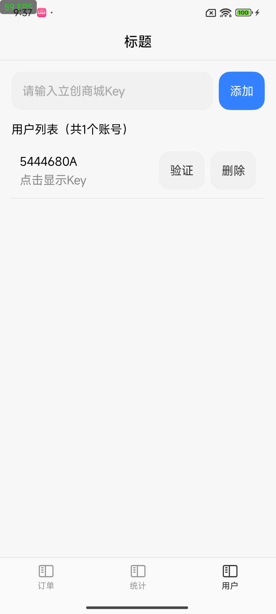
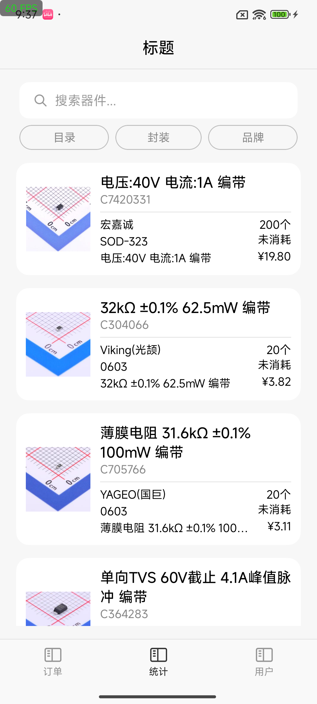

## 

# 立创商城元件工具

  
立创商城元件工具 记录与查看所购买元件使用信息

## 项目简介

立创商城元件工具（LcManager）是一款基于 Kotlin Multiplatform 与 JetBrains Compose 构建的桌面端应用，旨在帮助用户记录、管理和查询在立创商城购买的元件及其使用信息。
该工具支持多平台运行，包括 Windows 和 Android，提供了现代化的用户界面，适配高分辨率显示设备。用户可以通过该工具方便地管理订单信息、查询元件库存状态以及跟踪元件使用情况。

## 软件截图

## 主要特性
- 订单信息管理与查询
- 元件库存统计与追踪
- 用户信息管理
- 多平台支持（Windows与Android）
- 现代化界面，支持高分辨率显示

## 安装与运行

## Star History Chart

